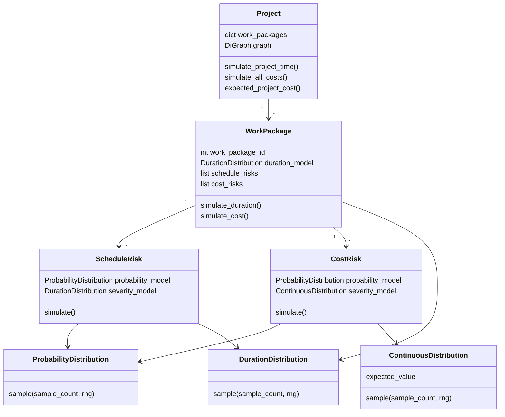
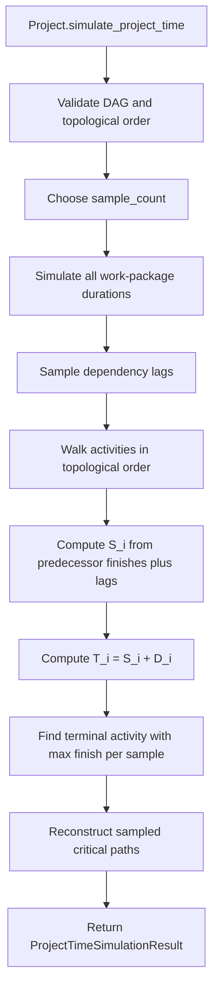

# SPM Software Architecture

This document explains how the `spm` package is structured from a software perspective. It is intended for developers who need to understand where concepts live, how data moves through the system, and where new models or interfaces can be added.

## Package Map

```text
src/spm/
  __init__.py                 Public package exports
  distributions.py            Distribution protocols and concrete probability models
  work_package.py             Activity-level duration, schedule risk, and cost risk logic
  project.py                  Project graph, dependency timing, critical paths, and project-level cost
  interfaces/
    __init__.py               Public interface exports
    project_xml.py            LibreProject/MS Project XML import and notebook diagnostics
    project_excel.py          Cleaned Excel workbook import and notebook diagnostics
    legacy_project_xml.py     Older XML interface kept for compatibility/reference
```

The main design split is:

- `spm.distributions`: small reusable sampling models.
- `spm.work_package`: logic for one activity.
- `spm.project`: logic across activities and dependencies.
- `spm.interfaces`: adapters that translate external files into the simulator's internal objects.

## Core Concepts

### Distributions

`distributions.py` defines protocols for values that can be sampled:

- `DurationDistribution`: nonnegative integer duration samples, stored as `np.uint32`.
- `ProbabilityDistribution`: occurrence probability samples in `[0, 1]`.
- `ContinuousDistribution`: nonnegative continuous samples, used for cost and continuous severity.

Concrete models include:

- `ShiftedPoissonDuration`
- `ShiftedBinomialDuration`
- `DiscreteUniformDuration`
- `UniformContinuousDistribution`
- `PERTDistribution`
- `DeterministicProbability`
- `DeterministicContinuousDistribution`

These models expose a common `sample(sample_count, rng)` interface. Many also expose `expected_value`, which lets higher-level code use analytic means when available and fall back to sample means when not.

### Work Packages

`WorkPackage` in `work_package.py` represents one activity `i` in the project network.

It owns activity-level models:

- baseline duration model `Z_i`
- schedule risks `R_i^{t,j}`
- daily cost model `K_i`
- fixed cost models `H_i^j`
- cost risks `R_i^{c,j}`

It also stores simulation outputs:

- baseline and total duration samples
- start and finish samples assigned by the project graph
- sampled incoming lag vectors
- baseline and total cost samples
- expected duration and cost summaries

`ScheduleRisk` and `CostRisk` both follow the same pattern:

1. sample an occurrence probability vector `P_i^j`
2. sample a severity vector `U_i^j`
3. sample Bernoulli occurrence indicators
4. multiply occurrence by severity to get the realized risk effect
5. compute `E[P_i^j] * E[U_i^j]` when possible

### Project

`Project` in `project.py` is the top-level simulation object.

It owns:

- `work_packages`: mapping from activity ID to `WorkPackage`
- `graph`: a `networkx.DiGraph` where edge `j -> i` means `j` is a predecessor of `i`
- random number generator
- sample-count and memory-budget settings
- last project-time and cost simulation outputs

The project layer is responsible for behavior that depends on more than one activity:

- validating the dependency graph as a DAG
- simulating all activity durations
- sampling dependency lags
- computing earliest starts and finishes in topological order
- computing project completion time
- reconstructing sampled critical paths
- computing project-level expected cost
- computing exact shifted-Poisson completion CDF for the narrow prototype case

## Object Relationship Diagram



## Time Simulation Flow

The normal project-time simulation is driven by `Project.simulate_project_time()`.



At activity level, `WorkPackage.simulate_duration()` does:

```text
Z_i samples = duration_model.sample(...)
schedule risk samples = sum_j R_i^{t,j}
D_i samples = Z_i samples + schedule risk samples
```

At project level, the earliest-start recursion is:

```text
S_i = 0                                      if Pred(i) is empty
S_i = max_j(T_j + L_{j,i}) for j in Pred(i) otherwise
T_i = S_i + D_i
T_project = max_i T_i over terminal activities
```

## Cost Simulation Flow

Project cost is accumulated through work packages.

```text
A_i = K_i * D_i + sum_j H_i^j
C_i = A_i + sum_j R_i^{c,j}
Project cost = sum_i C_i
```

Important ordering rule:

1. duration samples must exist before baseline cost can be simulated
2. baseline cost is computed from sampled daily cost and sampled duration
3. cost risks are simulated separately and added to baseline cost

`Project.simulate_all_costs()` runs this for every work package, and `Project.expected_project_cost()` sums each activity's expected total cost.

## Import Interfaces

The simulator core deliberately does not store human-facing labels such as task names, workbook rows, or XML metadata. Those live in `spm.interfaces`.

### XML Interface

`project_xml.py` reads LibreProject/MS Project XML files and builds a simulator `Project`.

Current prototype assumptions:

- each imported work package has notes like `Min: a_i`
- scheduled duration is interpreted as the smallest mode
- activity duration is modeled as `ShiftedPoissonDuration`
- dependency links are zero-lag finish-to-start edges

The returned `ImportedProject` stores:

- `simulator_project`: pure simulation object
- `tasks`: human-facing task metadata
- `network_graph`: graph for notebooks and visualization

### Excel Interface

`project_excel.py` reads a cleaned workbook with `Activities` and `Risks` sheets.

It translates workbook rows into:

- duration models
- daily and fixed cost models
- schedule and cost risks
- predecessor edges and deterministic lags

The returned `ImportedExcelProject` stores:

- `simulator_project`: pure simulation object
- `activities`: external activity metadata
- `risks`: external risk metadata
- `network_graph`: graph for notebooks and visualization

## Extension Points

### Add a New Duration Distribution

Create a class with:

```python
def sample(self, sample_count: int, rng: np.random.Generator) -> NDArray[np.uint32]:
    ...
```

Optionally add:

```python
@property
def expected_value(self) -> float:
    ...
```

If it satisfies `DurationDistribution`, `WorkPackage` and `Project` can use it without changes.

### Add a New Probability or Cost Distribution

Use the same pattern as the existing continuous/probability models:

- validate constructor inputs in `__post_init__`
- return a vector of length `sample_count`
- keep probabilities in `[0, 1]`
- keep continuous costs/severities finite and nonnegative
- expose `expected_value` when analytic

### Add a New Importer

Keep importers in `spm.interfaces`.

A good importer should:

1. parse external data into metadata dataclasses
2. build a pure `Project`
3. add work packages and dependencies
4. attach risks and costs
5. return both the `Project` and the source metadata

This keeps the simulation code independent of file formats and notebook display needs.

## Design Invariants

- Activity IDs are positive integers.
- The project dependency graph must be acyclic.
- Duration, lag, start, and finish samples are nonnegative `uint32` values.
- Cost samples are finite nonnegative `float64` values.
- All Monte Carlo vectors in a simulation share the same `sample_count`.
- External labels and display metadata stay outside the core simulator.
- Risk occurrence probability and severity are treated as independent when computing expected effects.

## Tests

Tests are in `tests/` and currently cover:

- distribution behavior
- project graph and simulation behavior
- XML interface behavior

When changing the architecture, useful tests usually fall into one of these groups:

- distribution validation and sampling shape
- work-package duration/risk/cost assembly
- project DAG validation and timing recursion
- importer translation from external data to simulator objects
